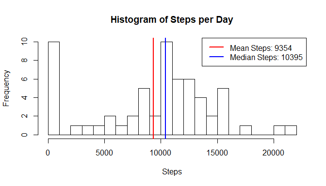
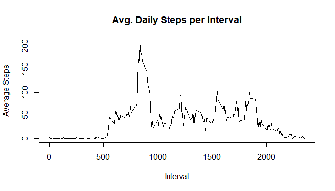
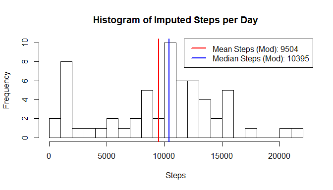
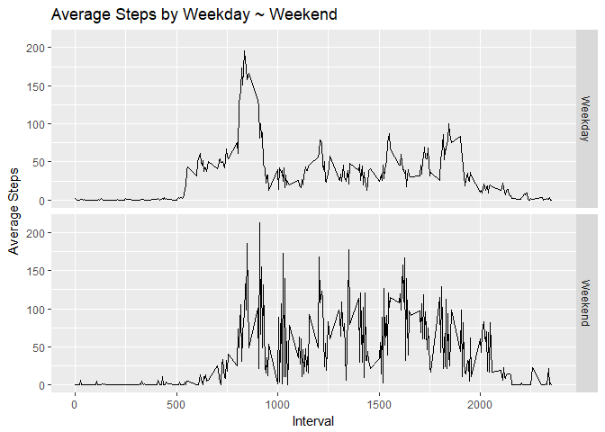

## Loading and preprocessing the data

Load data into R and convert date variable to date format. Load relevant packages.

```r
repdata <- read.csv(unzip("activity.zip"))
repdata$date <- as.Date(repdata$date, "%Y-%m-%d")
library(dplyr)
```

```
## 
## Attaching package: 'dplyr'
```

```
## The following objects are masked from 'package:stats':
## 
##     filter, lag
```

```
## The following objects are masked from 'package:base':
## 
##     intersect, setdiff, setequal, union
```

```r
library(ggplot2)
```


## What is mean total number of steps taken per day?

Compute total steps per day, get mean & median and plot histogram.


```r
daily_steps <- with(repdata, tapply(steps, date, sum, na.rm = T))
mean_steps <- mean(daily_steps)
median_steps <- median(daily_steps)

hist(daily_steps, breaks = 30, main = "Histogram of Steps per Day", xlab = "Steps")
abline(v = c(mean_steps, median_steps), lwd = 2, col = c("red", "blue"))
legend("topright", c(paste("Mean Steps:", round(mean_steps)), paste("Median Steps:", round(median_steps))), lty = c(1,1), lwd = 2, col = c("red", "blue"))
```

<!-- -->

The mean steps taken each day is **9354**, the median is **10395**.

## What is the average daily activity pattern?


```r
#Calculate mean steps per interval & plot as timeseries
interval_avg <- with(repdata, tapply(steps, interval, mean, na.rm=T))
plot(names(interval_avg), interval_avg, type="l", main = "Avg. Daily Steps per Interval", xlab = "Interval", ylab = "Average Steps")
```

<!-- -->

On average, the maximum steps occurred in interval **835** with **206** steps.

## Imputing missing values

There are **2304** out of **17568** rows with missing values or **0.04%**. Replacing missing values with median interval values as representative of typical.


```r
#Calculate Median Values
interval_median <- with(repdata, tapply(steps, interval, median, na.rm=T))

#Set up function to return imputed values
imputeAvg <- function() {
    y = c()
    for(n in 1:nrow(repdata)) {
        if(is.na(repdata[n, "steps"])) {
            y <- c(y, interval_median[[as.character(repdata[n, "interval"])]])
        }
        else {
            y <- c(y, repdata[n, "steps"])
            }
        }
        y
    }

#Create modified data set with imputed values for NA in steps
repdataMod <- mutate(repdata, steps = imputeAvg())

#Calculate the mean & median of the imputed data set & plot a histogram
daily_steps_mod <- with(repdataMod, tapply(steps, date, sum, na.rm = T))
mean_steps_mod <- mean(daily_steps_mod)
median_steps_mod <- median(daily_steps_mod)
hist(daily_steps_mod, breaks = 30, main = "Histogram of Imputed Steps per Day", xlab = "Steps")
abline(v = c(mean_steps_mod, median_steps_mod), lwd = 2, col = c("red", "blue"))
legend("topright", c(paste("Mean Steps (Mod):", round(mean_steps_mod)), paste("Median Steps (Mod):", round(median_steps_mod))), lty = c(1,1), lwd = 2, col = c("red", "blue"))
```

<!-- -->

With the imputed values, the mean steps taken each day is **9504**, the median is **10395**. Imputing missing values has had the effect of increasing the mean daily steps, bringing it closer to the median value.

## Are there differences in activity patterns between weekdays and weekends?


```r
#Create factor variable for weekday / weekend
repdataMod$weekday <- as.factor(ifelse(weekdays(repdataMod$date) == c("Saturday", "Sunday"), "Weekend", "Weekday"))

#Plot as timeseries panel
g <- ggplot(repdataMod, aes(interval, steps))
g + stat_summary(fun.y = "mean", geom = "line") + facet_grid(weekday~.) + labs(title = "Average Steps by Weekday ~ Weekend") + labs(x = "Interval") + labs(y = "Average Steps")
```

<!-- -->

The weekend pattern shows clear differences to the weekday pattern. It begins much later and has much greater variability throughout the day.
